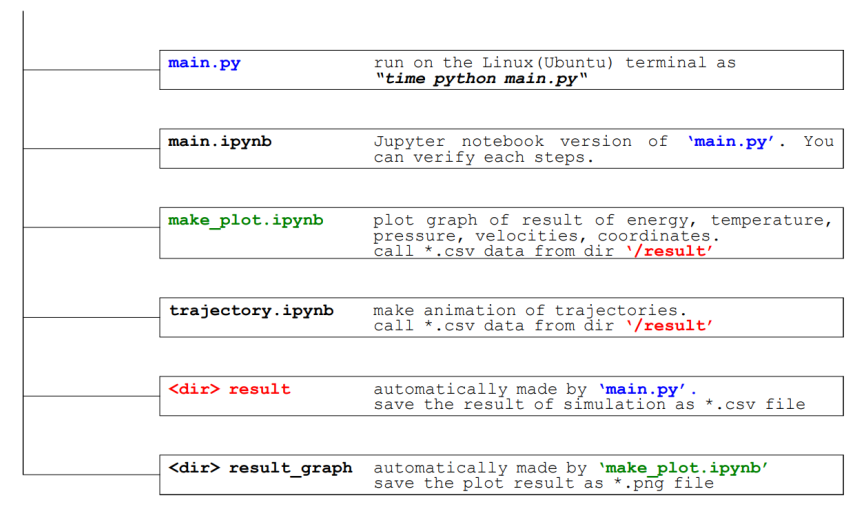

# Nose-Hoover-Chain
Canonical Ensemble in Molecular Dynamics (NVT Ensemble), Nose-Hoover Chain   

It follows Frenkel & Smit 's book "Understanding Molecular Simulation From Algorithms to Applications"    

I attached a report for this project, incluidng entire Algorithm, backgrounds, program information, analysis of results.   

Read pdf file 'NVT ensemble for LJ-fluid with Nose-Hoover Chain'    

I wrote the documents without license. Be free.   

## Reference :
>[1] G. J. Martyna, M. L. Klein, M. Tuckerman. “NoseHoover chains: The canonical ensemble via continuous dynamics”.The Journal of Chemical Physics. 97,
2635(1992).   
>[2] D. C. Rapport, “The Art of Molecular Dynamics Simulation” (2nd edition).    
>[3] D. Frenkel, B. Smit, “Understanding Molecular Simulation From Algorithms to Applications” (2002).    
>[4] P. Mohazzabi, S. P. Shankar. “Maxwell-Boltzmann Distribution in Solids”.Journal of Applied Mathematics and
Physics, 2018, 6, 602-612.     
>[5] A. Cheng K. M. Merz, “Application of the Nose-Hoover Chain Algorithm to the Study of Protein Dynamics”
(1995) The Art of Molecular Dynamics Simulation” (2nd edition)   
>[6] P.H. H¨unenberger, “Thermostat algorithms for molecular dynamics simulations”, Adv. Polymer. Sci., 173, 105-
149 (2005).   

